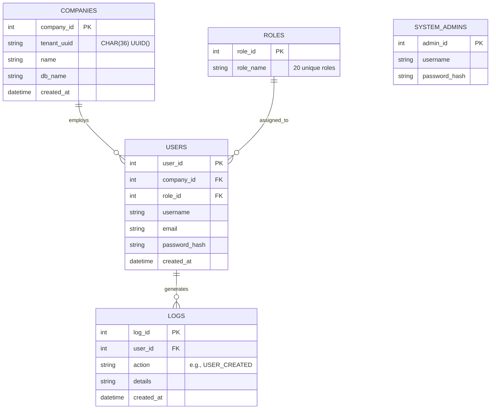

# Multi-Tenant RBAC DBMS (SaaS Core)

A fully isolated, multi-tenant database management system (DBMS) built for SaaS environments. This system features a robust **Role-Based Access Control (RBAC)** architecture supporting 20 different hierarchical roles, strict data isolation boundaries using Tenant UUIDs, full audit logging via MySQL triggers, and dual-login systems for Super Admins and Company Employees.

---

## 🏗️ Project Architecture & Directory Structure

```text
.
├── backend/
│   ├── auth.py              # Password hashing and JWT/Session token logic
│   ├── database.py          # Database connection configuration (TCP/Sockets)
│   ├── init_db.py           # Core schema definition, triggers, views, and initial data seeding
│   ├── main.py              # FastAPI application entrypoint
│   ├── middleware.py        # RBAC and Tenant-Isolation enforcement logic
│   ├── models.py            # Pydantic schemas for request validation
│   ├── routes/              # API Endpoints (auth, users, companies, roles)
├── frontend/
│   ├── app.py               # Streamlit Dashboard (UI)
├── Dockerfile.backend       # Docker image definition for FastAPI
├── Dockerfile.frontend      # Docker image definition for Streamlit
├── docker-compose.yml       # Complete environment orchestration (DB, API, UI)
├── requirements.txt         # Python dependencies
└── start_backend.sh         # Entrypoint script enforcing DB schema initialization
```

---

## 🗄️ Database Concepts & ER Diagram

This application leverages raw **MariaDB/MySQL** features, enforcing business logic directly at the database layer using Triggers, Views, and Stored Functions to maximize performance and guarantee data integrity across all tenants.

### Entity-Relationship (ER) Overview


### Advanced DBMS Features Implemented
1. **Triggers (`trg_after_user_insert`)**: Automatically intercepts `INSERT` operations on the `users` table and automatically creates a permanent audit trail in the `logs` table without requiring backend application logic.
2. **Database Views (`restricted_employee_view`)**: Exposes a sanitized, read-only slice of the `users` table (hiding sensitive `password_hash` columns) optimized for secure directory listing.
3. **Stored Functions (`count_users_per_company`)**: A deterministic SQL function that rapidly aggregates employee counts per tenant directly in the memory layer.
4. **Referential Integrity Constraints**: Strict `FOREIGN KEY` tracking with `ON DELETE CASCADE` preventing orphan users when companies are removed.

---

## 🚀 Installation & Setup

This repository supports **two** execution environments: A fully automated Docker environment (Recommended) and a Manual Host-System environment.

### Option 1: Docker Compose (Recommended - Zero Config)
You do not need MySQL installed on your local machine for this.

1. Ensure **Docker** and **Docker Compose** are installed on your machine.
2. Clone the repository and navigate into the root directory.
3. Run the following command:
   ```bash
   docker-compose up -d --build
   ```
4. **What Happens Automatically:**
   - A `mariadb:10.6` container starts and creates a persistent volume.
   - The `backend` container connects to the database, executes `backend/init_db.py` to build the entire schema and seed 20 roles, and then starts the API on Port `8000`.
   - The `frontend` container launches the Streamlit UI on Port `8501`.
5. Open your browser: `http://localhost:8501`

---

### Option 2: Manual / Local Host Installation
If you prefer running the application natively, ensure **MariaDB/MySQL** is installed and running on your system.

**1. Install Python Dependencies**
```bash
pip install -r requirements.txt
```

**2. Configure Environment Variables**

Copy the example environment file:
```bash
cp .env.example .env
```

Update the values in `.env` according to your local MySQL configuration. Example:
```env
DB_HOST=localhost
DB_PORT=3306
DB_USER=root
DB_PASSWORD=your_mysql_password
DB_NAME=saas_dbms
```

> **Note:** Docker users do not need to modify this file because Docker Compose automatically provides the required environment variables.

**3. Initialize the Database**

Run the initialization script to create the database, tables, triggers, views, stored functions, and sample data.
```bash
python backend/init_db.py
```

**4. Start the Backend API**
```bash
uvicorn backend.main:app --reload --port 8000
```

**5. Start the Frontend Dashboard**

Open a new terminal and run:
```bash
streamlit run frontend/app.py
```

**6. Open the Application**

Visit:
```text
http://localhost:8501
```

> **Security Note:** Never commit your actual `.env` file to GitHub. Only commit `.env.example`.

---

## 🛡️ Security & Role-Based Access Control (RBAC)

- **Strict Multi-Tenancy**: The `users` endpoint verifies `session["company_id"]` on every single request. An employee of Company A can physically never access records belonging to Company B.
- **Role Hierarchy**: 20 Distinct Roles exist. Only `Database Admin` and `HR` possess `users:write` privileges (Create/Update). Only `Database Admin` holds `users:delete` privileges.
- **Dual Authenticators**: `auth/super-login` (for SaaS infrastructure managers) vs `auth/tenant-login` (for isolated company workers).

## 💡 Default Credentials
For immediate testing after initialization:
- **System Admin**: `username: superadmin`, `password: superadmin123`
- **Tenant Admin (Acme Corp)**: `username: admin`, `password: admin123`
- **Tenant Employee (Acme Corp)**: `username: emp_carl`, `password: carl123`